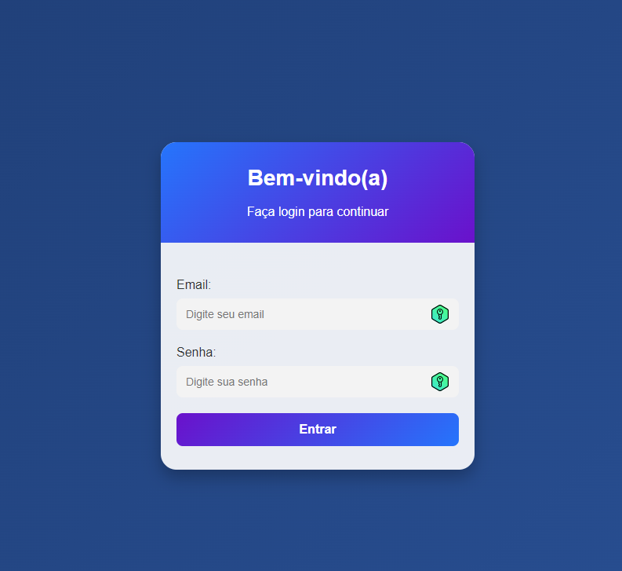

# Tela de Login Responsiva

Este projeto apresenta uma tela de login moderna e responsiva desenvolvida com HTML, CSS e JavaScript. O design inclui validação de campos e um fundo gradiente para tornar a interface visualmente atrativa e funcional.

## Características

- **Layout Moderno**: Uso de gradientes e estilos atualizados para um design profissional.
- **Responsividade**: Adaptado para diferentes tamanhos de tela, incluindo dispositivos móveis.
- **Validação de Formulários**: Regras para verificar a validade do email e o comprimento da senha.
- **Fundo Personalizável**: Possibilidade de customizar o banner de fundo para atender às necessidades do cliente.

## Tecnologias Utilizadas

- **HTML5**: Estrutura do projeto.
- **CSS3**: Estilização e design responsivo.
- **JavaScript**: Validação de formulário.

## Pré-requisitos

- Navegador moderno (Google Chrome, Firefox, etc.).
- Editor de código para personalizações (Visual Studio Code, Sublime Text, etc.).

## Previa

## Contribuição

- Sinta-se à vontade para contribuir com melhorias para este projeto. Faça um fork, implemente suas alterações e envie um pull request.